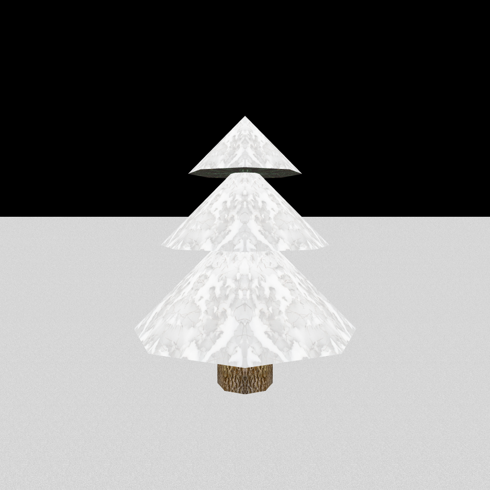
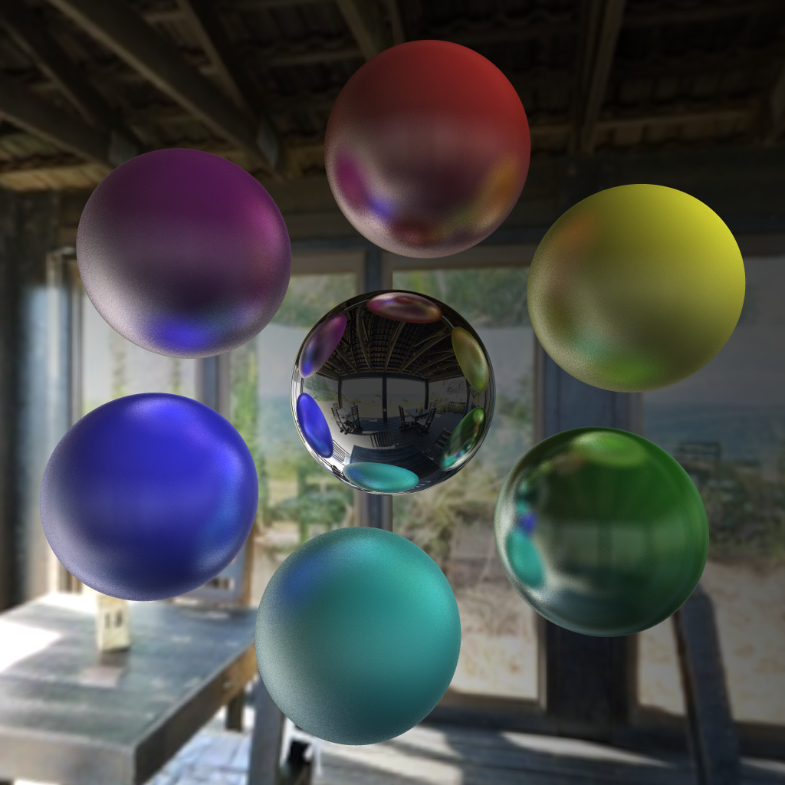
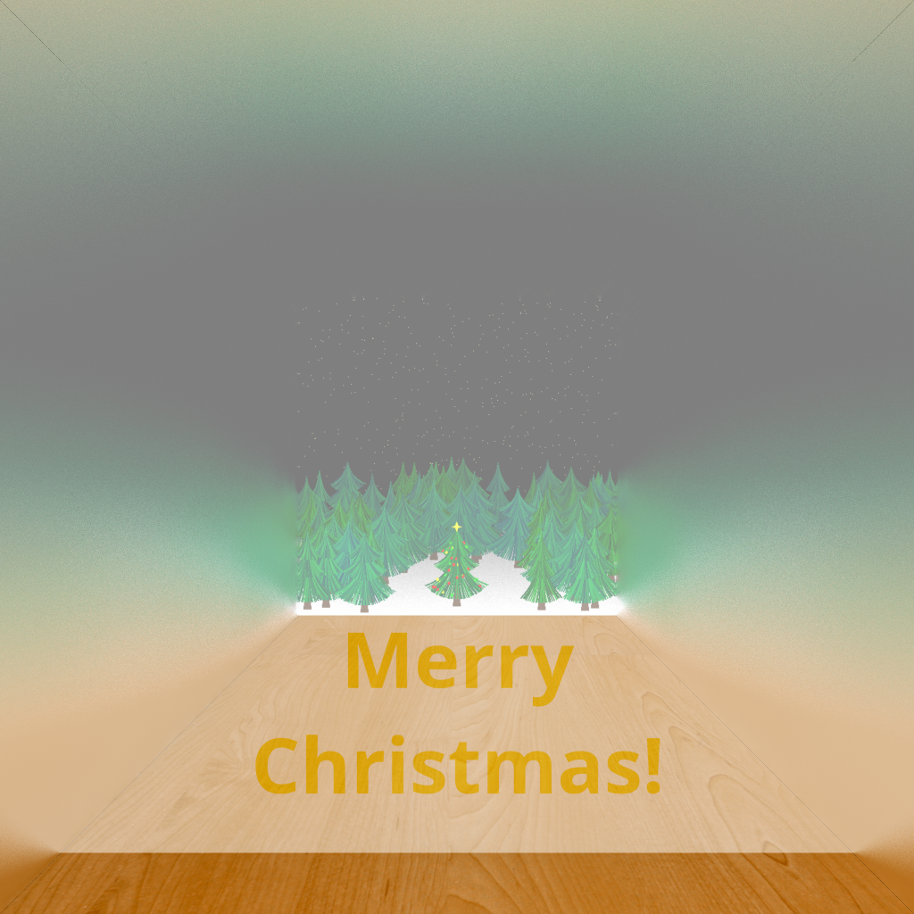
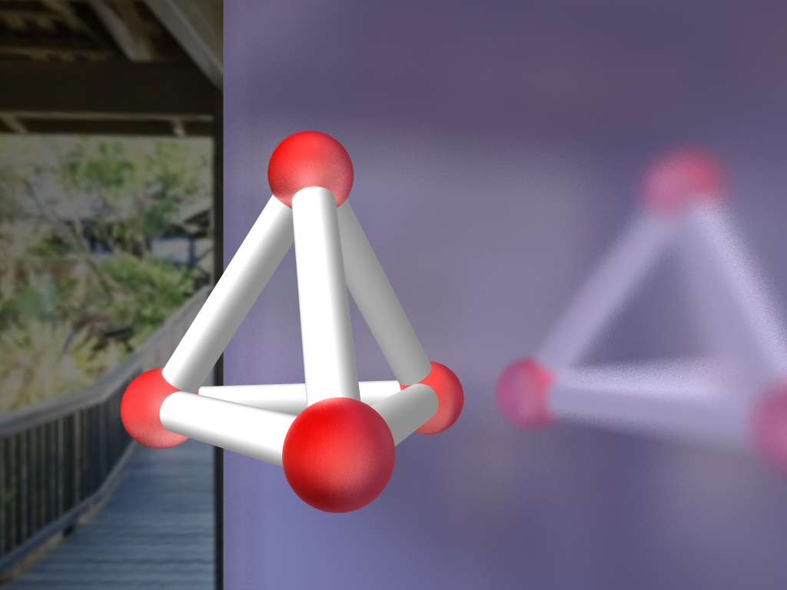

# rt

A simple unoptimized CPU-based raytracing implementation, supports basic meshes (sphere, cylinder,
plane, flat circle, triangle, models imported from .obj files) and textures (images imported from
.png and runtime-generated gradients).

`main.cpp` renders 4 scenes demonstrating some of the implemented features:
- **Winter**: .obj model import
- **Spheres**: skybox and materials
- **Reflection Box**: reflections inside enclosed space
- **Tetrahedron**: overlaping shapes

|       Winter        |       Spheres        |      Reflection Box      |       Tetrahedron        |
|:-------------------:|:--------------------:|:------------------------:|:------------------------:|
|  |  |  |  |

## Dependencies

The following libraries are used (both are included in the `lib` directory):
- [libspng](https://libspng.org)
- [Miniz](https://github.com/richgel999/miniz) (dependency of libspng)

## Licensing

This repository is licensed under the MIT license (see [LICENSE](LICENSE)), with the following
exceptions:
- `lib` directory contains external libraries, see [lib/LICENSE](lib/LICENSE) for links to their
    licenses
- `assets` directory contains images under CC0 (including non-original ones listed in
    [assets/ATTRIBUTIONS](assets/ATTRIBUTIONS))
